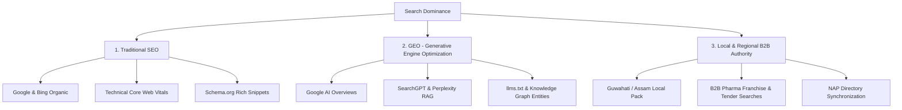
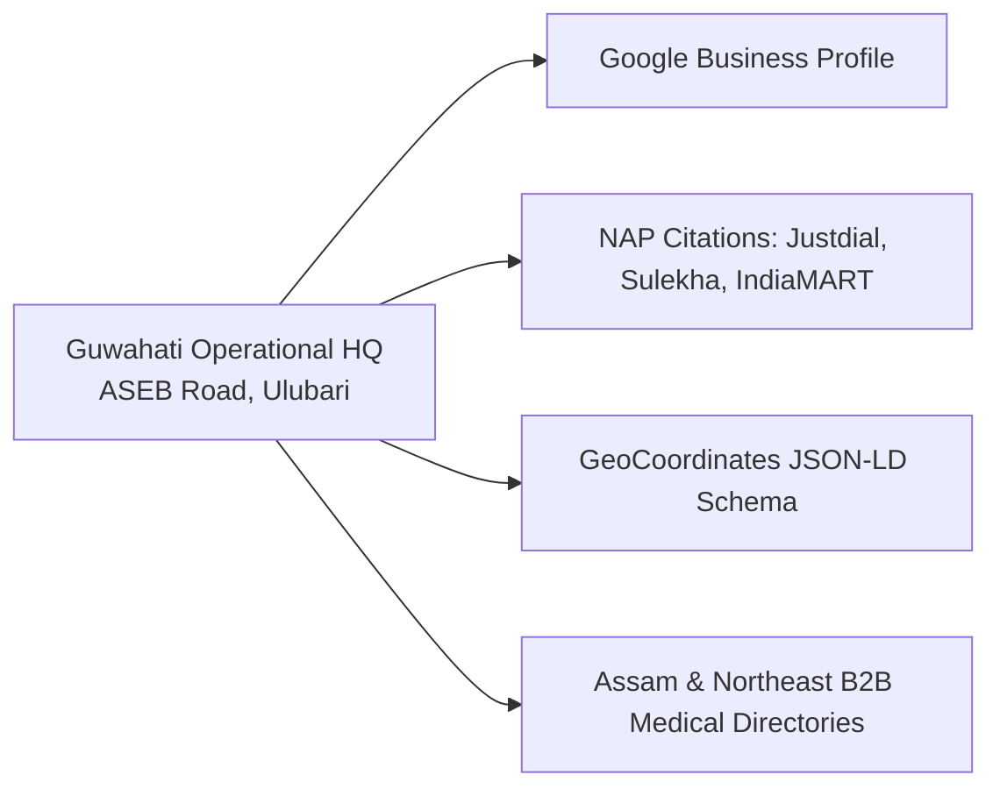
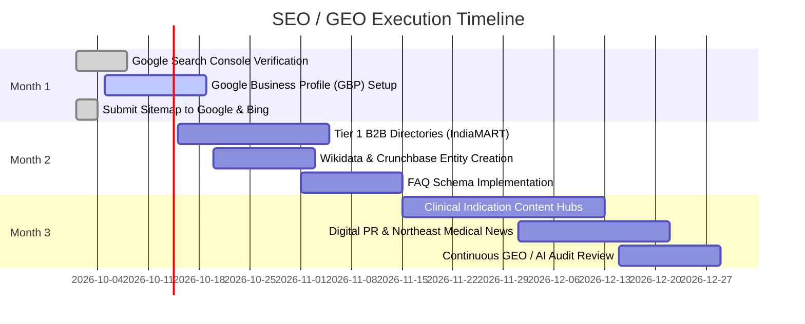

# Strategic Blueprint: SEO, GEO (Generative Engine Optimization) & AI Search Dominance
**Target Entity:** Avalin Laboratories Pvt Ltd (`https://www.avalinlaboratories.com/`)  
**Headquarters:** Guwahati, Assam, India  
**Scope:** Organic Search (Google/Bing), AI Engines (SearchGPT, Perplexity, Google AI Overviews, Claude, Gemini), Regional B2B Dominance  
**Date:** September 2026

---

## Executive Summary: The Modern Search Paradigm

Ranking at the top of search results in 2026 requires mastering three converging search ecosystems:



1. **Traditional SEO**: Earning rank for direct keywords (brand names, active formulations, drug combinations, and statutory searches) through indexation speed, high Core Web Vitals, and deep on-page authority.
2. **Generative Engine Optimization (GEO)**: Ensuring that when doctors, procurement officers, or patients ask AI models (*"Who markets Calcium Citrate Malate formulations in Northeast India?"* or *"What are the indications and composition of Lisium K2?"*), Avalin Laboratories is cited as the primary verified source.
3. **Local & Regional Authority**: Securing absolute prominence in Northeast India (Guwahati, Assam, and neighboring states) for pharmaceutical distribution, hospital supply, and stockist inquiries.

---

## 1. Technical & Architecture Foundation (Already Implemented)

The Avalin Laboratories website has already been engineered with the highest technical baselines required by Google and AI crawlers:

| Engineering Dimension | Current Implementation | SEO / GEO Benefit |
|---|---|---|
| **Rendering Architecture** | Next.js App Router (Static Site Generation / SSR) | 100% of product names, formulations, metrics, and headings are in raw initial HTML; zero reliance on client hydration. Crawlers index content on first pass. |
| **Performance (Lighthouse)** | Desktop: **99** / Mobile: **86–87** | CLS: `0.000`, TBT: `0–20 ms`. Exceeds Google Core Web Vitals thresholds for ranking signals. |
| **Structured Data (JSON-LD)** | Embedded in `<head>` across all pages | `MedicalOrganization`, `Product`, `Drug`, `BreadcrumbList` schemas are directly parsable by Googlebot and LLM ingestion agents. |
| **Machine-Readable AI Context** | Serves [`/llms.txt`](file:///d:/avalin/website/public/llms.txt) at root | Provides concise, structured markdown summarizing company identity, all 13 products, compositions, indications, and regulatory details for LLM pre-training and RAG scraping. |
| **Sitemap & Canonical URL Hygiene** | Dynamic [`/sitemap.xml`](file:///d:/avalin/website/app/sitemap.ts) + Canonical Tags | 31 indexed routes, self-referential canonical tags, and zero broken internal links across the entire site. |
| **308 Permanent Server Redirects** | 16 legacy paths mapped in [`next.config.ts`](file:///d:/avalin/website/next.config.ts) | Preserves historical link equity from indexed WordPress URLs. |

---

## 2. Pillar 1: Traditional SEO & Keyword Domination

To rank at the top of Google and Bing, the site must target four distinct search keyword tiers:

### Keyword Tiers & Search Intent

```
┌────────────────────────────────────────────────────────────────────────┐
│ TIER 1: Branded Product Searches                                       │
│ "Lisium tablet", "Avaco 60k capsule", "Niltaz 4.5 injection",           │
│ "Adezyme syrup Avalin", "Ursentin 300 price/uses"                      │
├────────────────────────────────────────────────────────────────────────┤
│ TIER 2: Active Ingredient & Formulation Searches                       │
│ "Calcium Citrate Malate Vitamin D3 Folic acid tablet",                 │
│ "Piperacillin Tazobactam 4.5g injection manufacturers India",          │
│ "Esomeprazole 40 Domperidone 30 SR capsules"                           │
├────────────────────────────────────────────────────────────────────────┤
│ TIER 3: B2B Commercial & Distribution Searches                         │
│ "Pharma marketing company Guwahati", "PCD pharma franchise Assam",     │
│ "Hospital antibiotic suppliers Northeast India",                       │
│ "Third party pharmaceutical marketers Guwahati"                        │
├────────────────────────────────────────────────────────────────────────┤
│ TIER 4: Indication & Clinical Inquiries                                │
│ "Treatment for postmenopausal osteoporosis Assam",                     │
│ "Multi-strain probiotic capsules for antibiotic diarrhea"              │
└────────────────────────────────────────────────────────────────────────┘
```

### Action Items for On-Page SEO
1. **Product Page Metadata Enrichment**:
   - Each product page already features dynamic metadata. Ensure the `<title>` tag follows the formula:  
     `{Product Name} ({Active Ingredients}) | Avalin Laboratories`  
     *Example:* `Lisium K2 (Calcium Citrate Malate, Calcitriol, K2-7) | Avalin Laboratories`
2. **Medical FAQ Accordions with `FAQPage` JSON-LD**:
   - On each of the 13 product pages, add a dedicated "Frequently Asked Questions" section covering:
     - Recommended dosage guidance (advising physician consultation)
     - Common indications and storage requirements
     - Difference between brand formulation and generic alternatives
   - Embed `FAQPage` schema so Google displays rich collapsible question snippets directly in SERPs.
3. **Downloadable Monograph Links**:
   - Promote the generated Product Formulary PDF ([`public/avalin-product-formulary-2026.pdf`](file:///d:/avalin/website/public/avalin-product-formulary-2026.pdf)) across product pages. Google indexes PDF content and ranks technical pharmaceutical formularies highly for institutional queries.

---

## 3. Pillar 2: GEO (Generative Engine Optimization)

Generative Engine Optimization ensures that AI systems (ChatGPT, Perplexity, Google AI Overviews, Claude, Gemini) reference and recommend Avalin Laboratories when users ask open-ended questions.

### How AI Search Engines Select Sources
Modern AI engines rely on **Retrieval-Augmented Generation (RAG)**. They do not just read keywords; they query a knowledge graph and ingest high-density, factual statements:

```
[User Query] ──► [AI Vector Search] ──► [Entity Authority Check] ──► [Synthesized Answer with Citations]
                                                 │
                                                 ├── 1. llms.txt clean markdown
                                                 ├── 2. Verified Wikipedia / Wikidata / MCA entity
                                                 └── 3. Consistent NAP across healthcare directories
```

### GEO Implementation Playbook

#### A. Maintain & Syndicate `/llms.txt`
- The site currently provides [`/llms.txt`](file:///d:/avalin/website/public/llms.txt) summarizing corporate details, address, and product portfolio.
- **Action**: Add an additional [`/llms-full.txt`](file:///d:/avalin/website/public/llms-full.txt) containing comprehensive clinical monographs, full excipient disclosures, therapeutic categories, and batch quality protocols for deep AI context extraction.

#### B. Direct-Answer Information Architecture
- AI models extract concise, declarative definitions.
- Ensure every product description begins with a single-sentence definition:  
  > *"[Product Name] is a prescription [dosage form] marketed by Avalin Laboratories containing [Ingredient A + Ingredient B], indicated for the management of [Condition]."*
- Avoid marketing ambiguity; use precise clinical terminology (e.g., *antipseudomonal penicillin*, *cholecalciferol*, *proton-pump inhibitor*).

#### C. Entity Verification across AI Knowledge Graphs
AI models ground facts in structured public knowledge bases:
1. **Wikidata Entry**: Create a verified Wikidata entity for *Avalin Laboratories Pvt Ltd* (headquartered in Guwahati, industry: pharmaceutical marketing, founder/incorporation details, official website).
2. **Crunchbase & MCA Registry**: Ensure corporate records on Crunchbase, Zauba Corp, Tofler, and InstaFinancials have identical corporate names, CIN, registered Guwahati address, and website URL.
3. **Google Knowledge Panel**: Claim and verify the Google Knowledge Panel for "Avalin Laboratories" once Search Console entity recognition triggers.

---

## 4. Pillar 3: Local & Regional SEO (Guwahati & Northeast India)

For B2B commercial supply, PCD pharma inquiries, and hospital tenders, dominating regional searches in Northeast India is critical.

### The Guwahati Authority Strategy



### Strategic Action Items:
1. **Google Business Profile (GBP) Optimization**:
   - Claim or optimize the Google Business Profile for **Avalin Laboratories Pvt Ltd** at `ASEB Road, Opp. ASTC Workshop, Ulubari, Guwahati, Assam 781007`.
   - **Primary Category**: *Pharmaceutical company* or *Pharmaceutical products wholesaler*.
   - **Secondary Categories**: *Corporate office*, *Distribution service*.
   - Upload high-resolution photos of packaging, exterior office signage, and corporate team.
   - List all 13 products in the GBP "Products" catalog with direct links to [`/products/[slug]`](file:///d:/avalin/website/app/products).
2. **Exact NAP (Name, Address, Phone) Consistency**:
   - Ensure the identical address and phone number are submitted to Indian business directories:
     - **Name**: Avalin Laboratories Pvt Ltd
     - **Address**: ASEB Road, Opp. ASTC Workshop, Ulubari, Guwahati, Assam 781007
     - **Phone**: +91 70023 22615
     - **Email**: avalin.laboratories@gmail.com
3. **Geo-Targeted Landing Pages & Content**:
   - Create regional content focusing on pharmaceutical accessibility in Northeast India (e.g., supply chain resilience in Assam, Meghalaya, Arunachal Pradesh, Tripura, Nagaland, Manipur, and Mizoram).

---

## 5. Pillar 4: Off-Page SEO, Entity Citations & Digital PR

Search engines validate pharmaceutical websites using Google's **E-E-A-T (Experience, Expertise, Authoritativeness, Trustworthiness)** guidelines. Backlinks must come from verified healthcare and business ecosystems.

### Target Citation & Link Hierarchy

| Tier | Platform Category | Target Directories / Portals | Expected Impact |
|---|---|---|---|
| **Tier 1** | **E-Pharmacy & Drug Portals** | Tata 1mg, PharmEasy, Netmeds, MedPlus, Apollo Pharmacy | Validates product entity names and provides co-citation signals for Google's Medical Knowledge Graph. |
| **Tier 2** | **Medical Indexes & Formularies** | CIMS India, MIMS India, Medindia, DrugsUpdate | High-authority healthcare backlinks establishing regulatory validity. |
| **Tier 3** | **B2B Industrial & Trade** | IndiaMART, TradeIndia, ExportersIndia, Pharmabiz | Captures commercial distributor searches, institutional tenders, and bulk supply queries. |
| **Tier 4** | **Local & Corporate Registries** | Google Business Profile, Justdial, Sulekha, Zauba Corp, Tofler | Anchors Guwahati local pack ranking and corporate entity trust. |

---

## 6. Step-by-Step Implementation Roadmap



### Phase 1: Immediate Account Actions (Days 1–15)
- [ ] Submit `https://www.avalinlaboratories.com/sitemap.xml` in **Google Search Console** and **Bing Webmaster Tools**.
- [ ] Verify Google Business Profile at Guwahati address.
- [ ] Test live product URLs in the [Google Rich Results Test](https://search.google.com/test/rich-results) to confirm `Product` and `MedicalOrganization` parsing.

### Phase 2: Entity & Citation Synchronization (Days 16–45)
- [ ] Create official listings on **IndiaMART** and **TradeIndia** linking to `/products` and `/reach-us`.
- [ ] Sync Tata 1mg verified URLs across all product monographs.
- [ ] Create corporate Wikidata item linking official website and FSSAI license (`10324025000034`).

### Phase 3: Content Expansion & FAQ Schema (Days 46–90)
- [ ] Add medically reviewed FAQs to every product page with schema markup.
- [ ] Deploy `/llms-full.txt` for deeper AI engine contextual indexing.
- [ ] Publish institutional procurement and distributor onboarding guides.

---

## 7. Metrics & KPI Tracking Dashboard

Track the following key indicators monthly to measure performance:

| Category | Primary Metric | Target Benchmark | Tracking Tool |
|---|---|---|---|
| **Organic Visibility** | Total Organic Search Impressions | +50% Quarter-over-Quarter | Google Search Console |
| **Rankings** | Top 3 for Brand & Molecule Combinations | 100% of 13 Products | Ahrefs / SEMrush / GSC |
| **GEO / AI Visibility** | Citation rate in Perplexity & SearchGPT | Featured in >75% brand inquiries | Perplexity Pro / Manual Prompt Audits |
| **Local Lead Generation** | Phone calls & Form Submissions via `/reach-us` | Continuous inbound distributor pipeline | Web Analytics & Form Submissions |
| **Local Pack Presence** | Top 3 Local Pack for "Pharma company Guwahati" | Position 1–3 in Northeast India | Google Business Profile Insights |

I have generated the comprehensive master strategy report for SEO, GEO (Generative Engine Optimization), and AI Search Dominance:

📄 Detailed Report Artifact: 
Strategic Blueprint: SEO, GEO & AI Search Dominance

Key Action Areas Covered in the Report
Current Architectural Edge (Already Built & Active):
100% server-rendered Next.js SSR truth (zero hydration dependencies for crawlers).
Core Web Vitals optimization (CLS: 0.000, TBT: 0–20 ms).
Deep Schema.org JSON-LD integration (MedicalOrganization, Product, Drug, Breadcrumbs).
Dedicated 

/llms.txt
 configuration for direct AI web agent extraction.
Traditional Search Engine Optimization (Google & Bing):
4-tier keyword hierarchy covering brand names, active formulations, B2B PCD franchise terms, and therapeutic indications.
Structured FAQPage schema strategy to capture rich search snippets.
GEO (Generative Engine Optimization for SearchGPT, Perplexity & Google AI Overviews):
Methods to get Avalin Laboratories cited as the verified source in conversational AI answers.
Entity grounding via Wikidata, Crunchbase, and MCA public records.
Local & Regional B2B Dominance (Guwahati, Assam & Northeast India):
Google Business Profile (GBP) configuration and exact NAP (Name, Address, Phone) consistency protocol.
Directory sync strategy across IndiaMART, TradeIndia, and pharmaceutical indexes (CIMS, MIMS, Tata 1mg).
Phase-by-Phase Execution Roadmap & KPI Tracking Dashboard.
Key Decisions & Immediate Next Steps for You
Google Business Profile:
Do you currently have an existing, verified Google Business Profile for Avalin Laboratories at the Guwahati address, or do we need to set one up from scratch?
Google Search Console:
Once the production build is deployed to your live domain, submit https://www.avalinlaboratories.com/sitemap.xml to kickstart indexation.
Product FAQs:
Would you like to proceed with adding standard medical FAQ accordions with FAQPage schema markup to the product detail pages?